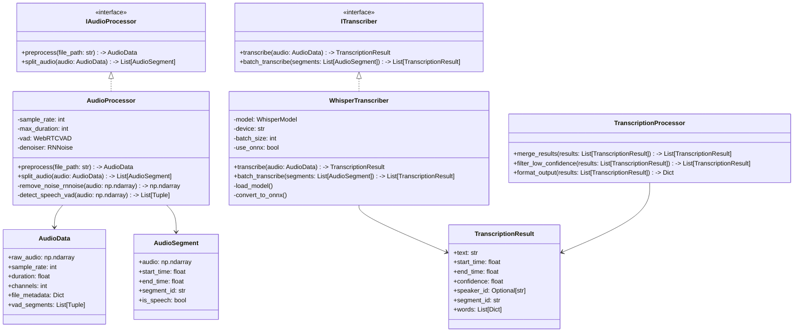
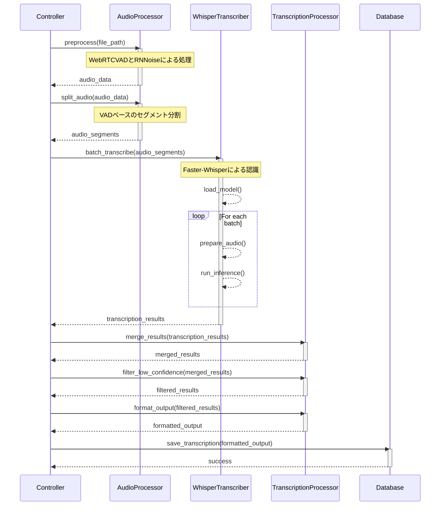

# システムアーキテクチャ

## システム概要
音声認識システムは、高精度な日本語音声認識を実現するために、最新の技術を組み合わせた3層アーキテクチャを採用しています。

## アーキテクチャ図

### クラス図

### シーケンス図

## コンポーネント詳細

### 1. 音声処理層（AudioProcessor）
音声の前処理と分割を担当する層です。

#### 主要機能
- 音声ファイルの読み込みと正規化
- WebRTCVADによる音声区間検出
- RNNoiseによるノイズ除去
- 音声セグメントへの分割

#### 技術選定理由
- WebRTCVAD: 高精度なリアルタイム音声検出が可能
- RNNoise: 深層学習ベースの効率的なノイズ除去

### 2. 認識層（WhisperTranscriber）
音声認識を実行する中核層です。

#### 主要機能
- Faster-Whisperモデルの管理
- バッチ処理による効率的な認識
- ONNXランタイムによる最適化
- 日本語特化の設定

#### 技術選定理由
- Faster-Whisper: オリジナルWhisperの2-3倍の処理速度
- ONNX: 推論の高速化と最適化

### 3. 後処理層（TranscriptionProcessor）
認識結果の整形と最適化を担当する層です。

#### 主要機能
- 認識結果のマージ
- 低信頼度結果のフィルタリング
- 出力フォーマットの整形
- 日本語テキストの正規化

## データフロー

1. 入力フェーズ
   - 音声ファイルの読み込み
   - メタデータの抽出
   - 形式の正規化

2. 前処理フェーズ
   - ノイズ除去
   - 音声区間検出
   - セグメント分割

3. 認識フェーズ
   - モデルのロード
   - バッチ処理による認識
   - 信頼度スコアの計算

4. 後処理フェーズ
   - 結果のマージ
   - フィルタリング
   - フォーマット変換

## エラーハンドリング

### 実装方針
- 各層で専用の例外クラスを定義
- 適切なエラーメッセージとログ出力
- リトライ機構の実装
- グレースフルデグラデーション

### エラー種別
1. 入力エラー
   - ファイル不存在
   - フォーマット不正
   - メタデータ不正

2. 処理エラー
   - メモリ不足
   - GPU関連エラー
   - モデルロードエラー

3. システムエラー
   - リソース枯渇
   - 並列処理エラー
   - I/Oエラー

## 設定管理

### 設定ファイル構成
- config.yaml: メインの設定ファイル
- logging.yaml: ログ設定ファイル

### 主要設定項目
- 音声処理パラメータ
- モデル設定
- 最適化オプション
- エラーハンドリング設定

## 拡張性

### 拡張ポイント
1. 音声処理
   - 新しい前処理アルゴリズムの追加
   - 異なるVADの実装

2. 認識エンジン
   - 新しいモデルの追加
   - 異なる推論エンジンの実装

3. 後処理
   - カスタム出力フォーマット
   - 追加の後処理ステップ

### インターフェース
- IAudioProcessor
- ITranscriber
- カスタムイベントハンドラ